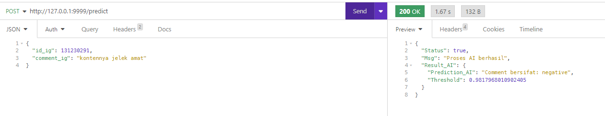
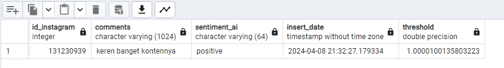

<h1> Instagram Comment Sentiment Analysis API with FastAPI and FastText</h1>


<h2> Source Dataset: [https://github.com/rizalespe/Dataset-Sentimen-Analisis-Bahasa-Indonesia/tree/master?tab=readme-ov-file]</h2><p>Luqyana, W., Cholissodin, I., & Perdana, R.S. (2018). Analisis Sentimen Cyberbullying pada Komentar Instagram dengan Metode Klasifikasi Support Vector Machine. Jurnal Pengembangan Teknologi Informasi Dan Ilmu Komputer, 2(11), 4704-4713. Diambil dari http://j-ptiik.ub.ac.id/index.php/j-ptiik/article/view/3051</p>

<h2> API Usage </h2>
Send a POST request to /predict with a JSON body containing the Instagram comment to be analyzed:

```JSON
{
	"id_ig": int,
	"comment_ig": str
}
```

The API will return the sentiment classification:

```JSON
{
	"Status": bool,
	"Msg": str,
	"Result_AI": {
		"Prediction_AI": str,
		"Threshold": float
	}
}
```

Example:



